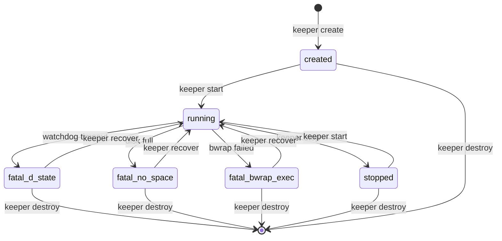
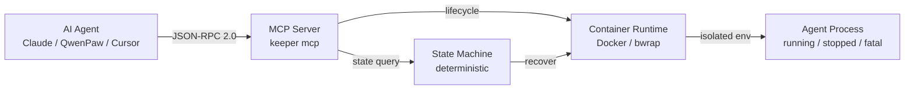

<p align="center">
  
  <h3>Keeper</h3>
  <p>AI Agent 的 Linux 运行时 —— 单一二进制，零宿主机依赖，开箱即用</p>
  <p>
    <a href="https://github.com/SuiJQ/Keeper/actions/workflows/ci.yml/badge.svg"></a>
    <a href="https://img.shields.io/badge/Go-1.21-blue"></a>
    <a href="https://img.shields.io/github/v/release/SuiJQ/Keeper"></a>
    <a href="https://img.shields.io/badge/license-MIT-black"></a>
    <a href="https://img.shields.io/badge/coverage-79%25-green"></a>
    <a href="https://img.shields.io/badge/binary-≤20MB-orange"></a>
  </p>
</p>

---

## 🚀 30 秒体验

```bash
# 1. 下载单一静态二进制
curl -fsSL https://raw.githubusercontent.com/SuiJQ/Keeper/main/hack/install.sh | sh

# 2. 创建你的第一个 Agent 运行时
keeper create agent-01

# 3. 启动、拷贝文件、查看状态
keeper start agent-01
keeper cp ./my-app agent-01:/app
keeper inspect agent-01

# 4. 停止或销毁
keeper stop agent-01
keeper destroy agent-01
```

---

## 🎯 为什么选 Keeper？

| 能力 | Docker raw | bwrap raw | Podman | OpenSandbox | E2B | **Keeper** |
|------|-----------|-----------|--------|-------------|-----|------------|
| 单一静态二进制 | ❌ | ❌ | ❌ | ❌ | ❌ | **✅ ≤20MB** |
| Agent 状态机 | ❌ | ❌ | ❌ | ⚠️ 部分 | ❌ | **✅ 确定性终态** |
| MCP 内置 | ❌ | ❌ | ❌ | ✅ | ❌ | **✅ 原生 JSON-RPC 2.0** |
| 看门狗自愈 | ❌ | ❌ | ❌ | ❌ | ❌ | **✅ D 态熔断** |
| 快照 / 回滚 | ❌ | ❌ | ❌ | ❌ | ❌ | **✅ git-like** |
| 双后端热切换 | ❌ | ❌ | ❌ | ⚠️ Docker/K8s | ❌ | **✅ Docker / bwrap** |
| 零宿主机依赖 | ❌ | ✅ | ❌ | ❌ | ❌ | **✅ 开箱即用** |
| Seccomp + clone3 拦截 | ⚠️ | ⚠️ | ⚠️ | ⚠️ 可选 | ❓ | **✅ Defense-in-depth** |
| DNS 隔离清洗 | ❌ | ❌ | ❌ | ⚠️ 部分 | ❓ | **✅ 内置** |
| 本地离线可用 | ✅ | ✅ | ✅ | ⚠️ 部分 | ❌ | **✅ 完全离线** |
| 部署复杂度 | 高 | 中 | 高 | 高 | 低 | **✅ 极低** |
| 开源协议 | Apache 2.0 | - | LGPL | - | MIT | **MIT** |

---

## 🧠 核心设计：不是“又一个容器工具”，而是 **Agent Runtime**

市面上所有容器工具都只保证 **“进程级生命周期”**，不保证 **“业务级状态收敛”**。Keeper 从设计上就是为了 AI Agent 控制面而生：

### 1. 确定性状态机 + Fatal 终态（最强护城河）



> “你的 AI Agent 不会无限挂起、不会半死不活、不会丢失状态。Keeper 保证 **100% 收敛**到可预测状态。”

### 2. MCP 控制面与容器生命周期深度绑定

Keeper 不是“给 MCP 加个 HTTP wrapper”，而是 **MCP Server 直接驱动 Container 状态机**。



> “AI Agent 不再需要 shell script 或 REST API，直接用 **JSON-RPC 2.0** 控制生命周期。”

### 3. Git-like Agent 操作语义

```bash
# 零学习成本：开发者已经懂的动词
keeper fork my-agent v2          # git clone
keeper cp my-agent:/src ./dst    # git checkout
keeper snapshot my-agent snap-01 # git commit
keeper rollback my-agent snap-01 # git revert
keeper inspect my-agent          # git status
```

> “如果你的 Agent crashed，不是 `docker logs` 翻海量日志，而是 `keeper rollback my-agent snap-20260101` **秒级回滚**。”

### 4. 单一静态二进制 + 双后端 pragmatic 设计

```bash
# Docker 环境里一键启动
keeper start my-agent

# 无 Docker 环境里单文件运行
./keeper-linux-amd64 start my-agent
```

> “Docker 环境里一键启动，无 Docker 环境里单文件运行。**一个二进制，两种模式，无需 root，无需 installer。**”

---

## 🛡️ 安全与隔离

| 能力 | 实现位置 | 宣传价值 |
|------|---------|---------|
| 抽象 Unix Socket | `internal/mcp/server.go` | “连 socket 文件都不留，安全 + 干净” |
| Seccomp BPF + clone3 拦截 | `internal/seccomp/seccomp.go` | “syscall 层白名单，defense-in-depth” |
| DNS sanitization | `internal/container/network_strategy.go` | “容器 DNS 永远不会泄漏宿主机 resolver” |
| OverlayFS dry-run probe | `internal/bootstrap/probe.go` | “启动前就告诉你内核不支持，不让你踩坑” |
| 日志环形缓冲 + dropped 指标 | `internal/logring/` | “长时间运行不爆内存，丢日志也有指标” |
| ENOSPC 熔断 | `internal/storage/store.go` | “存储满了也不会留下半个僵尸 Agent 目录” |
| PGID 确定性获取 | `internal/container/bwrap.go` | “看门狗 `kill(-pgid, SIGKILL)` 绝不漏杀” |

---

## 📊 与主流 AI Sandbox / Runtime 对比

| 维度 | Keeper | Tencent AGS | E2B | OpenSandbox | AgentScope Runtime | OpenHands Canvas | Docker raw |
|------|--------|-------------|-----|-------------|-------------------|------------------|------------|
| **部署形态** | 本地单二进制 | 云服务 | 云服务 | 本地 / K8s 平台 | Python 框架 | 本地全栈应用 | 本地 daemon |
| **Agent 状态机** | ✅ 确定性终态 | ❌ | ❌ | ⚠️ 部分 | ❌ | ❌ | ❌ |
| **MCP 内置** | ✅ 原生 | ❌ | ❌ | ✅ | ⚠️ 兼容 | ⚠️ 通过 ACP | ❌ |
| **快照 / 回滚** | ✅ git-like | ❌ | ❌ | ❌ | ❌ | ❌ | ❌ |
| **看门狗自愈** | ✅ D 态熔断 | ❌ | ❌ | ❌ | ❌ | ❌ | ❌ |
| **单一二进制** | ✅ ≤20MB | ❌ SDK + 云 | ❌ SDK + 云 | ❌ 多组件 | ❌ Python 包 | ❌ Node.js | ❌ |
| **零宿主机依赖** | ✅ | ❌ 需云 SDK | ❌ 需 API Key | ❌ 需 Docker/K8s | ❌ 需 Python | ❌ 需 Node.js | ⚠️ 需 daemon |
| **Seccomp / 系统调用过滤** | ✅ BPF + clone3 | ❓ | ❓ | ⚠️ 可选 | ❓ | ❓ | ⚠️ 需手动配置 |
| **DNS 隔离清洗** | ✅ 过滤 127.0.0.x | ❓ | ❓ | ⚠️ 部分 | ❓ | ❓ | ❌ |
| **OverlayFS 探测** | ✅ dry-run | ❓ | ❓ | ❓ | ❓ | ❓ | ❌ |
| **日志可观测性** | ✅ ring buffer + metrics | ❓ | ❓ | ✅ | ✅ | ✅ | ❌ |
| **本地离线可用** | ✅ | ❌ | ❌ | ⚠️ 部分 | ⚠️ 部分 | ⚠️ 部分 | ✅ |
| **开源协议** | MIT | ❓ | MIT | ❓ | Apache 2.0 | MIT | Apache 2.0 |
| **学习曲线** | 低 | 中 | 低 | 高 | 中 | 中 | 中 |
| **适用场景** | 本地 Agent Runtime | 云端沙箱服务 | 云端代码执行 | 大规模 K8s 调度 | Python Agent 应用 | 开发者控制台 | 通用容器编排 |

> **定位差异**：
> - **Tencent AGS / E2B**：云端沙箱即服务，适合需要远程隔离、按需扩容的场景，但依赖云账号与网络。
> - **OpenSandbox / AgentScope Runtime**：平台级框架，适合 K8s 集群或 Python 生态内的 Agent 应用，但重量级、依赖重。
> - **OpenHands Agent Canvas**：开发者控制台，聚焦“多 Agent 编排 + 自动化”，但本身不是轻量运行时。
> - **Keeper**：**本地-first 单二进制 Agent Runtime**，适合追求零依赖、低延迟、离线可用、MCP 原生控制的开发者。

---

## 📁 项目结构

```
keeper/
├── cmd/keeper/           # CLI 入口与子命令
├── internal/
│   ├── agent/            # Agent 状态机（created/running/stopped/fatal_*）
│   ├── container/        # 容器运行时抽象（Docker + bwrap 双后端）
│   ├── mcp/              # MCP Server（JSON-RPC 2.0 over Unix Socket）
│   ├── storage/          # Agent 文件系统 + 快照/回滚
│   ├── watchdog/         # 看门狗（D 态检测 + kill(-pgid)）
│   ├── seccomp/          # Seccomp BPF 过滤器
│   ├── bootstrap/        # 启动前探测（OverlayFS dry-run）
│   └── logring/          # 日志环形缓冲 + dropped 指标
├── docs/
│   ├── MCP_GUIDE.md      # MCP 集成指南
│   ├── RELEASE_CHECKLIST.md
│   └── USER_GUIDE.md     # 用户快速上手指南
└── pkg/config/           # 配置热加载
```

---

## 📖 文档

- [用户指南](README_USER.md) - 快速上手与日常使用
- [开发者指南](README_DEV.md) - 架构、开发流程与贡献指南
- [MCP 集成指南](docs/MCP_GUIDE.md) - AI Agent 通过 MCP 控制 Keeper
- [发布检查清单](docs/RELEASE_CHECKLIST.md) - v0.1.0 收尾与发布流程

---

## 🤝 贡献

欢迎提交 Issue 和 Pull Request！

1. Fork 本仓库
2. 创建特性分支 (`git checkout -b feature/amazing-feature`)
3. 提交更改 (`git commit -m 'feat: add amazing feature'`)
4. 推送到分支 (`git push origin feature/amazing-feature`)
5. 开启 Pull Request

---

## 📄 许可证

MIT © [SuiJQ](https://github.com/SuiJQ)

---

## ⭐ 如果这个项目对你有帮助，请给个 Star！

Star 历史：[](https://star-history.com/#SuiJQ/Keeper&Date)
